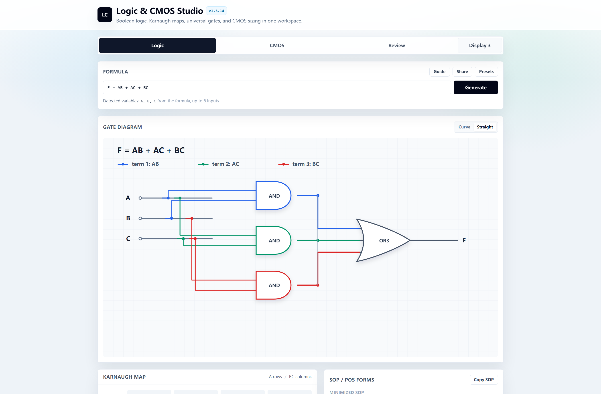
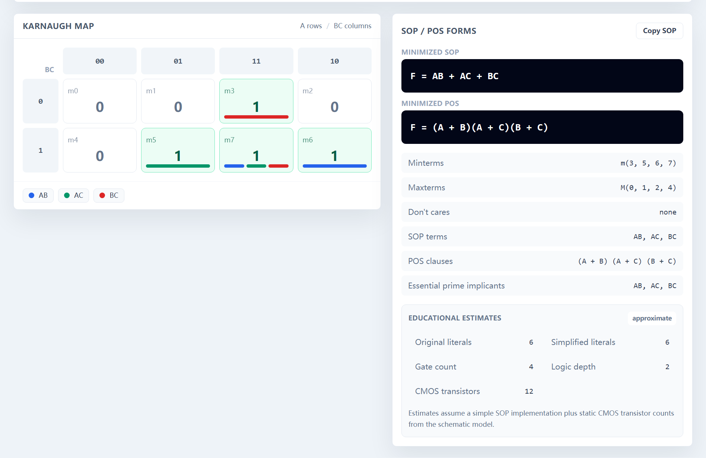
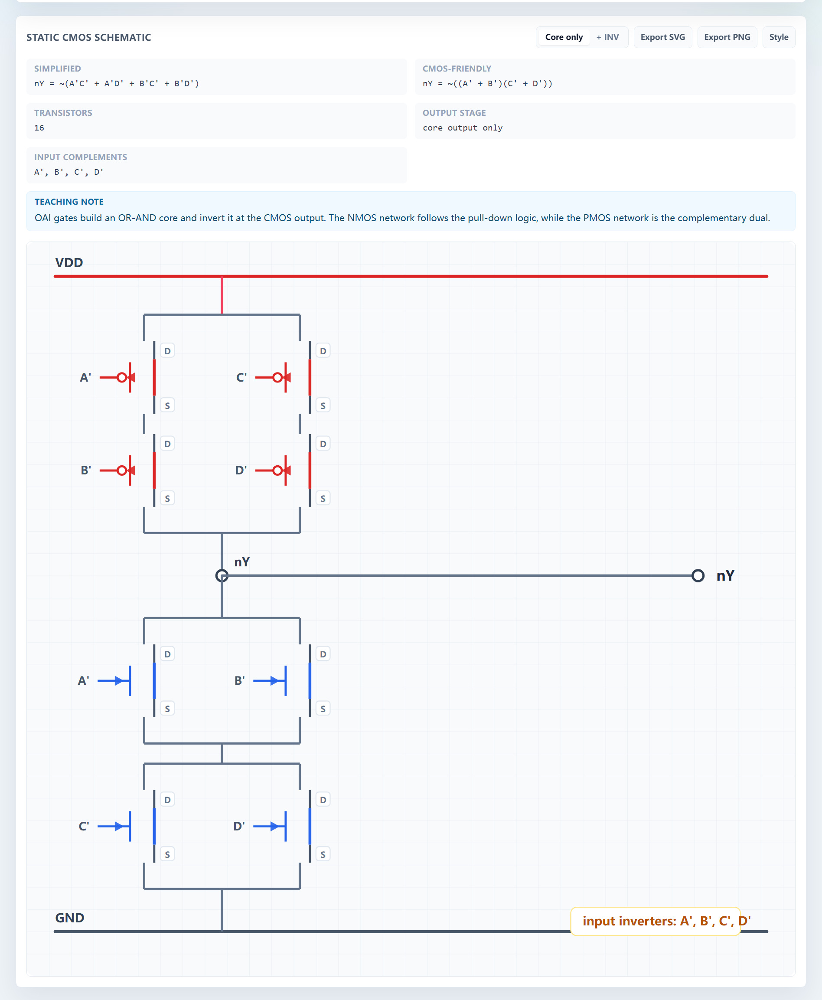
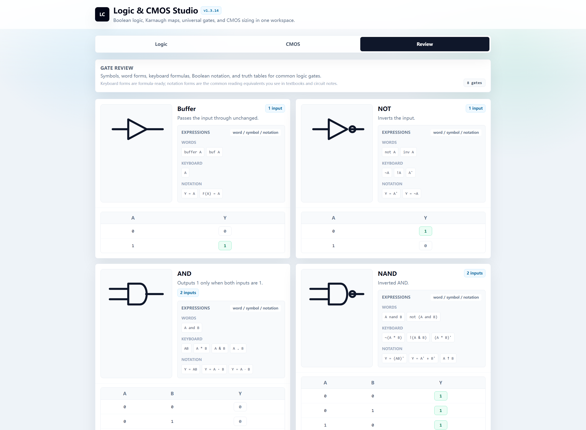

# Logic & CMOS Studio

Logic & CMOS Studio is a browser-based educational EDA mini-tool that converts Boolean logic into truth tables, Karnaugh maps, simplified equations, Verilog, and static CMOS pull-up / pull-down schematics.

- Version: v1.3.14
- GitHub Pages: https://marksui.github.io/logic-cmos-studio/

## Features

- Boolean formula input with words, symbols, postfix NOT, custom variables, function headers, minterms, and don't-care terms.
- Truth table generation with editable output cells.
- 2-variable, 3-variable, and 4-variable Karnaugh maps using Gray-code ordering, with grouped implicant indicators.
- SOP and POS simplification with selected terms, essential prime implicants, minterms, maxterms, and don't-cares.
- Synthesizable Verilog module export with a copy button.
- Educational estimates for literal count, gate count, transistor count, and logic depth.
- Static CMOS pull-up and pull-down schematic visualization with PMOS/NMOS networks, netlist, sizing notes, and SVG/PNG export.
- Example gallery for NOT, NAND2, NOR2, AOI/OAI, MUX, majority, half adder, and full adder logic.
- Shareable URL support through `?expr=...`.

## Screenshots









## Architecture

The app is a Vite, React, and TypeScript single-page application. The logic engine lives in `src/logic/`, while the UI panels live in `src/components/`.

- `src/logic/formula.ts` parses Boolean expressions, custom variable names, function headers, minterms, and don't-care terms into an evaluable logic model.
- `src/logic/kmap.ts` generates truth-table rows and Gray-code Karnaugh map data.
- `src/logic/simplify.ts` performs SOP/POS simplification and tracks minterms, maxterms, don't-cares, prime implicants, and editable truth-table output states.
- `src/logic/cmos.ts` converts simplified logic into teaching-level static CMOS pull-up and pull-down plans, netlists, and transistor-count metadata.
- `src/logic/metrics.ts`, `src/logic/sizing.ts`, and `src/logic/universalGates.ts` provide educational estimates, transistor sizing notes, and NAND/NOR conversion helpers.
- `src/components/` renders the formula workspace, gate diagram, K-map, truth table, CMOS schematic, universal-gate view, Verilog panel, and review page.
- `src/App.tsx` currently orchestrates workspace state, panel visibility, formula application, URL sharing, and export/copy flows.

## Limitations

- CMOS diagrams are educational approximations, not SPICE-accurate schematics. They do not model parasitics, sizing constraints, layout effects, body ties, noise margins, or timing closure.
- Simplification and K-map teaching flows are targeted at 2 to 4 variables. The parser and internal variable model can accept up to 8 inputs, but detailed K-map visualization and exhaustive simplification become hard to read and increasingly expensive beyond 4 variables.
- Gate counts, transistor counts, literal counts, and logic depth are estimates for learning and comparison, not synthesis reports.
- Verilog export emits a simple combinational `assign`; it does not generate testbenches, timing constraints, or technology-mapped netlists.
- Planned future work includes dark theme/PWA support, PDF report export, more export targets for K-maps and gate diagrams, expanded unit tests and CI, larger Quine-McCluskey flows, approximate RC/FO4 delay teaching, hazard detection, and an external JSON API.

## Changelog

See [CHANGELOG.md](CHANGELOG.md) for release notes.

## Run Locally

```bash
npm install
npm run dev
```

Then open the Vite local URL shown in the terminal.

## Build

```bash
npm run build
npm run test:formula
```

## Deploy To GitHub Pages

This project is configured with:

```json
"homepage": "https://marksui.github.io/logic-cmos-studio/"
```

Build the app and push the committed `dist/` output to `main`:

```bash
npm run build
git add -A
git commit -m "Release vX.Y.Z"
git tag -a vX.Y.Z -m "vX.Y.Z"
git push origin main --follow-tags
```

## Why This Project

Boolean logic is the bridge between high-level digital design and transistor-level implementation. This studio connects the flow in one place: a Boolean equation becomes a truth table, the truth table becomes a Karnaugh map, the map becomes simplified SOP/POS equations, the equations become RTL-style Verilog, and the same logic can be inspected as static CMOS pull-up and pull-down networks for VLSI learning.
